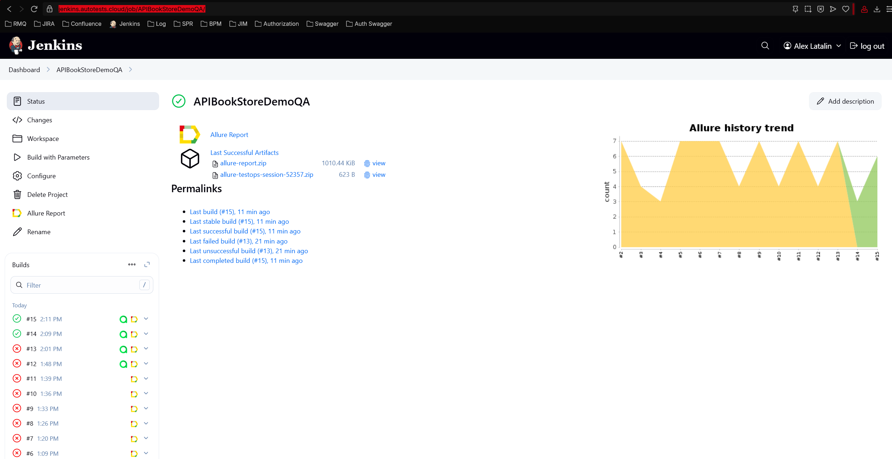
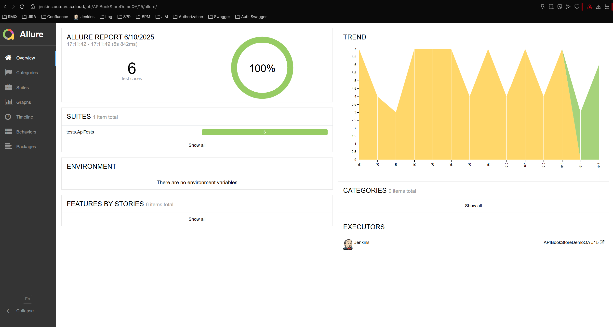
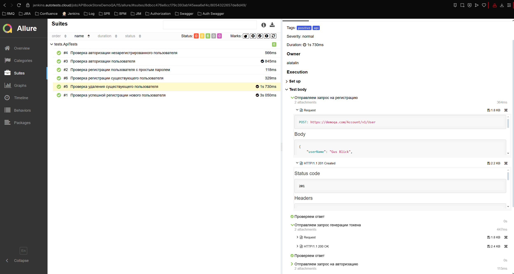
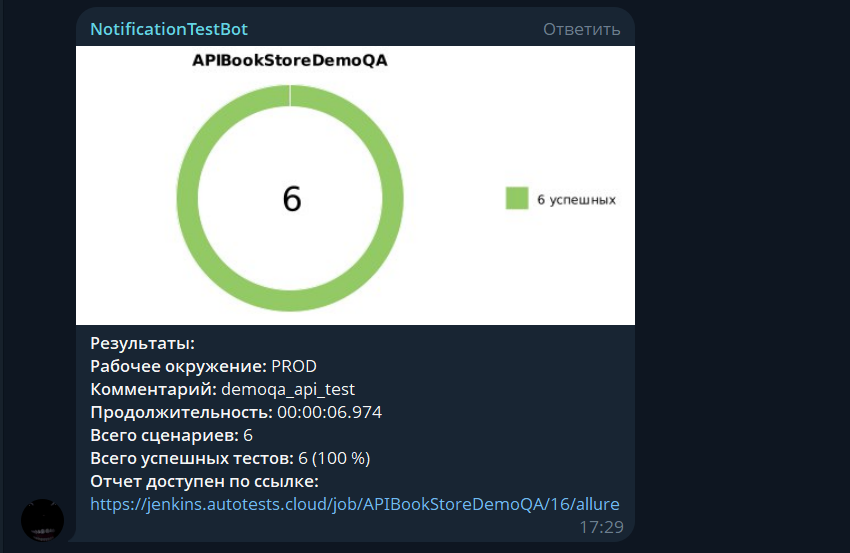

# Проект по автоматизации тестовых сценариев API для демо-магазина [Demoqa](https://demoqa.com)
<p align="center">


## :pushpin: Содержание:

- [Использованный стек технологий](#computer-использованный-стек-технологий)
- [Примеры автоматизированных кейсов](#примеры-автоматизированных-кейсов)
- [Запуск тестов из терминала](#arrow_forward-запуск-тестов-из-терминала)
- [Сборка в Jenkins](#сборка-в-jenkins)
- [Пример Allure-отчета](#пример-allure-отчета)
- [Уведомления в Telegram с использованием бота](#уведомления-в-telegram-с-использованием-бота)

## :computer: Использованный стек технологий

<p align="center">
<a href="https://www.jetbrains.com/idea/"></a>
<a href="https://www.java.com/"></a>
<a href="https://selenide.org/"></a>
<a href="https://aerokube.com/selenoid/"></a>
<a href="https://github.com/allure-framework"></a>
<a href="https://qameta.io/"></a>
<a href="https://gradle.org/"></a>
<a href="https://junit.org/junit5/"></a>
<a href="https://github.com/"></a>
<a href="https://www.jenkins.io/"></a>
<a href="https://web.telegram.org/"></a>
<a href="https://www.atlassian.com/software/jira"></a>
</p>

- В данном проекте автотесты написаны на языке <code>Java</code> с использованием фреймворка для тестирования Selenide.
- В качестве сборщика был использован - <code>Gradle</code>.
- Использованы фреймворки <code>JUnit 5</code> и [Selenide](https://selenide.org/).
- Для удаленного запуска реализована джоба в <code>Jenkins</code> с формированием Allure-отчета и отправкой результатов в <code>Telegram</code> при помощи бота.

Содержание Allure-отчета:
* Шаги теста;

### Примеры автоматизированных кейсов

- [x] Проверка успешной регистрации нового пользователя
- [x] Проверка регистрации существующего пользователя
- [x] Проверка регистрации пользователя c простым паролем
- [x] Проверка авторизации пользователя
- [x] Проверка авторизации незарегистрированного пользователя
- [x] Проверка удаления существующего пользователя

## :arrow_forward: Запуск автотестов

### Запуск тестов из терминала
```
gradle clean demoqa_api_test
```
При выполнении команды, данные тесты запустятся удаленно в <code>Selenoid</code>.

### Запуск тестов на удаленном браузере
```
gradle clean demoqa_api_test -DremoteHost=${REMOTE}"
```
### Параметры сборки

* <code>REMOTE</code> – адрес удаленного сервера, на котором будут запускаться тесты.

##  [Сборка в Jenkins](https://jenkins.autotests.cloud/job/APIBookStoreDemoQA/)
<p align="center">

</p>

##  [Пример Allure-отчета](https://jenkins.autotests.cloud/job/APIBookStoreDemoQA/15/allure/#)
### Overview

<p align="center">

</p>

### Результат выполнения теста

<p align="center">

</p>

##  Уведомления в Telegram с использованием бота

После завершения сборки, бот созданный в <code>Telegram</code>, автоматически обрабатывает и отправляет сообщение с результатом.

<p align="center">

</p>

